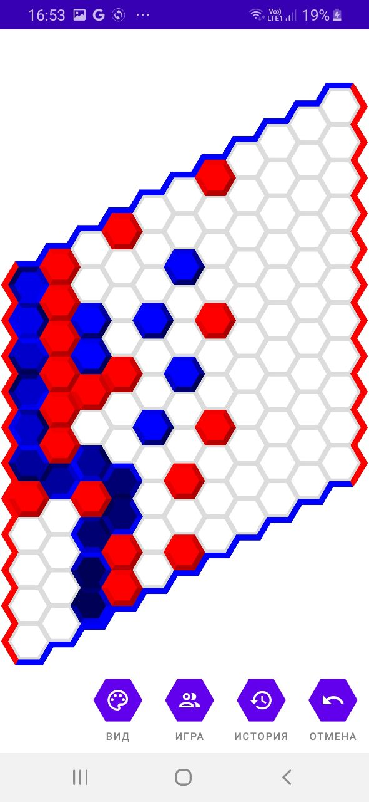

<b>
  

    Скачать: 
    <a href="https://github.com/GrishaninVyacheslav/con-tac-tix/releases/download/signed-pre-release/con-tac-tix.apk">con-tac-tix.apk</a>
  

  

    Стек технологий: Retrofit, Kotlin Coroutines, Room, Fragments.
  

</b>

Демонстрация работы приложения: https://youtu.be/fvXm39dM1T4

Con-tac-tix - это реализация математической игры Гекс.
В приложении могут играть два человека, реализована доска,
контроль правил, проверка условий победы.
Используется MVP архитектура реализованная с помощью Moxy.

  
  
  

